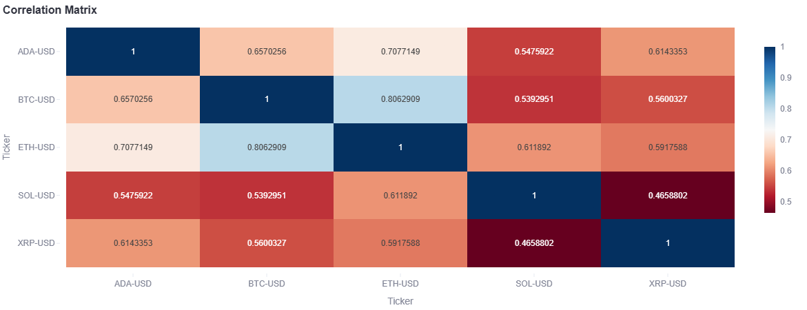

### Network-Based Portfolio Analytics for Global Equities, Crypto, Bonds, Commodities, and ETFs

A robust, research-grade platform for constructing portfolios of global equities, crypto, bonds, commodities, and ETFs using network-based methods (correlation clustering, HRP, MST, cluster-based, centrality-based) with a Streamlit dashboard.

#### Features
- Asset selection from global indices, sectors, themes, crypto, bonds, commodities, and ETFs
- Correlation matrix, correlation graph, network graph, MST, cluster maps, dendrograms
- Hierarchical Risk Parity (HRP), MST, cluster-based, centrality-based portfolio construction
- Community detection, centrality analysis, topology insights
- Interpretable performance metrics: mean return, volatility, Sharpe, Sortino, max drawdown, turnover, alpha/beta, centrality scores
- Rolling stats, drawdowns, regime shifts, cluster evolution
- Educational info and tooltips for network finance concepts
- Example notebook for research workflows

#### Quick Start
1. Install requirements: `pip install -r requirements.txt`
2. Run the dashboard: `streamlit run main_app.py`

## Outstanding for Quant Research & GitHub
- Modular codebase: data, network, portfolio, analytics, visualization
- Well-documented functions and classes
- Example notebooks and usage guides
- Clean README with diagrams and references

---
### Project Visualizations

---

#### How to Use & Interpret

##### Dashboard Features
- **Asset Selection:** Choose assets from global indices, sectors, themes, crypto, bonds, commodities, or ETFs for portfolio construction.
- **Factor & Strategy Selection:** Select how relationships are modeled (correlation, partial correlation, mutual information) and portfolio construction method (HRP, MST, cluster-based, etc.).
- **Benchmark Selection:** Pick a benchmark index or asset for performance comparison (alpha, beta, risk premium).
- **Performance Metrics:** View risk-adjusted returns (Sharpe, Sortino, Calmar), drawdowns, turnover, alpha/beta, centrality scores, and more.
- **Visualizations:** Explore correlation matrices, network graphs, MSTs, dendrograms, drawdown charts, and cluster maps.
- **Project Guide & Glossary:** Sidebar info explains all terms and metrics used.

##### How to Interpret Results
- **Sharpe/Sortino/Calmar Ratios:** Higher values indicate better risk-adjusted performance.
- **Alpha/Beta:** Alpha is excess return over benchmark; beta is sensitivity to benchmark movements.
- **Market Risk Premium:** Difference between portfolio and benchmark mean returns.
- **Drawdown:** Largest drop from peak to trough; lower is better.
- **Centrality Scores:** Higher centrality means more influence in the asset network.
- **Clusters/Communities:** Tightly connected groups may represent sectors, themes, or regimes; diversify across clusters for robustness.
- **Network Topology:** Star-like networks imply centralized risk; modular networks suggest diversified exposure.
- **Strategy Choice:** HRP is robust to estimation error; MST and cluster-based methods help avoid overexposure to correlated assets.

##### Educational Resources
- See the sidebar and dashboard glossary for explanations of all terms and concepts.
- References section links to recent research and foundational papers.

#### Industry Standard Thresholds for Interpretation

- **Sharpe Ratio:**
  - < 1: Suboptimal
  - 1–2: Acceptable for diversified portfolios
  - > 2: Excellent risk-adjusted performance
- **Sortino Ratio:**
  - < 1: Suboptimal
  - 1–2: Acceptable
  - > 2: Excellent
- **Calmar Ratio:**
  - < 0.5: High risk
  - 0.5–1: Moderate risk
  - > 1: Good risk-adjusted return
- **Max Drawdown:**
  - < -20%: Significant risk
  - -10% to -20%: Moderate risk
  - > -10%: Low risk
- **Alpha:**
  - > 0: Outperformance vs. benchmark
  - < 0: Underperformance
- **Beta:**
  - ~1: Moves with benchmark
  - < 1: Less volatile than benchmark
  - > 1: More volatile than benchmark
- **Information Ratio:**
  - < 0.5: Weak
  - 0.5–1: Moderate
  - > 1: Strong
- **Turnover:**
  - < 0.5: Low (cost efficient)
  - 0.5–1: Moderate
  - > 1: High (may incur higher costs)
- **Centrality Scores:**
  - High centrality: Asset is influential, may drive portfolio risk
  - Low centrality: Asset is peripheral, may offer diversification

These thresholds are guidelines; context and asset class matter. For crypto, higher volatility and drawdowns are common. For equities, lower risk metrics are preferred. For bonds, commodities, and ETFs, risk and return profiles differ and should be interpreted accordingly.

#### Network Interpretation Guide

##### Steps in Interpretation

**1. Understand the Network Construction**
- Are edges based on Pearson correlation, partial correlation, or mutual information?
- Is it a fully connected network, or was it filtered (e.g., using MST or correlation thresholding)?
- *Example*: Correlation-based MST might remove weak or noisy edges, showing the most important asset relationships.

**2. Identify Key Assets (Nodes)**
- Central nodes (using centrality metrics like degree, betweenness, eigenvector) often represent influential or diversified assets.
- Peripheral nodes may be idiosyncratic, sector-specific, or represent unique themes, bonds, commodities, or ETFs.

**3. Interpret Clusters/Communities**
- Groups of tightly connected assets often:
  - Belong to the same sector, theme, asset class (crypto, bonds, commodities, ETFs)
  - Share macroeconomic exposure
  - Show co-movement in prices
- Use community detection algorithms (e.g., Louvain, Girvan–Newman) to identify these.

**4. Analyze Edge Weights**
- Strong edges (thick lines or high weights) imply tight relationships—good for hedging or pair trading.
- Weak or absent edges imply independence—good for diversification.

**5. Topology Insights**
- A star-like shape implies centralized exposure (one dominant asset, sector, or class).
- A modular or clustered graph implies multiple distinct sectors, themes, or regimes.
- A sparse network may indicate low market integration or higher diversification potential.

##### Interpretation for Portfolio Construction
| Insight                | Portfolio Implication                                 |
|------------------------|------------------------------------------------------|
| Central node           | Can act as a proxy for the network (high beta/influence) |
| Peripheral asset       | May offer diversification benefits                    |
| Tightly connected cluster | Avoid overexposing to one cluster or correlated assets |
| Network sparsity       | Higher potential for diversification                  |
| Dynamic changes        | Track evolution over time to detect regime shifts, market stress, contagion |

##### Network-Based Portfolio Construction Methods
| Method                        | How It Uses the Network                                         |
|-------------------------------|----------------------------------------------------------------|
| Hierarchical Risk Parity (HRP) | Uses dendrograms built from correlation distances to assign weights based on hierarchy |
| Cluster-based investing        | Allocates based on network communities (clusters)               |
| Minimum Spanning Tree (MST) portfolios | Uses MST structure to select diversified but central assets |
| Network centrality-based allocation | Allocates more (or less) weight to central assets depending on strategy (momentum vs contrarian) |

##### Performance Interpretation
- Often more robust to estimation error than classic mean-variance models.
- Offers intuitive control over diversification and exposure.
- Useful in regime detection or understanding market contagion.

---

#### Recent References
- **Network-based portfolio selection:**
  - Song, W., & Tumminello, M. (2023). "Network-based portfolio selection: A review and new perspectives." arXiv:2302.06681. https://arxiv.org/abs/2302.06681
  - Pozzi, F., Di Matteo, T., & Aste, T. (2013). "Spread of risk across financial markets: better to invest in the peripheries." Scientific Reports, 3, 1665. https://www.nature.com/articles/srep01665
- **Hierarchical Risk Parity (HRP):**
  - Lopez de Prado, M. (2016). "Building diversified portfolios that outperform out-of-sample." The Journal of Portfolio Management, 42(4), 59-69. https://jpm.iijournals.com/content/42/4/59
  - Lopez de Prado, M. (2016). "Hierarchical Risk Parity." SSRN. https://ssrn.com/abstract=2708678
- **Graph-based diversification:**
  - Mantegna, R. N. (1999). "Hierarchical structure in financial markets." The European Physical Journal B, 11(1), 193-197. https://link.springer.com/article/10.1007/s100510050929
  - Tumminello, M., Lillo, F., & Mantegna, R. N. (2010). "Correlation, hierarchies, and networks in financial markets." Journal of Economic Behavior & Organization, 75(1), 40-58. https://www.sciencedirect.com/science/article/pii/S0167268109002397
- **Crypto portfolio networks:**
  - Musmeci, N., Nicosia, V., & Aste, T. (2017). "Crypto-asset networks: Decoding correlations and clustering in digital currencies." arXiv:1704.00226. https://arxiv.org/abs/1704.00226

#### Tech Stack
- Python, Streamlit, Pandas, NumPy, Plotly, yfinance, scipy, networkx, scikit-learn

---

### Disclaimer
This project is intended solely for educational purposes and as an innovative guide for quantitative researchers. It does not constitute investment advice or a recommendation to buy, sell, or hold any financial asset. Users should conduct their own due diligence and consult professional advisors before making investment decisions.

---

GitHub: https://github.com/QuantDevJayson
PyPI: https://pypi.org/user/jayson.ashioya
LinkedIn: https://www.linkedin.com/in/jayson-ashioya-c-082814176/
